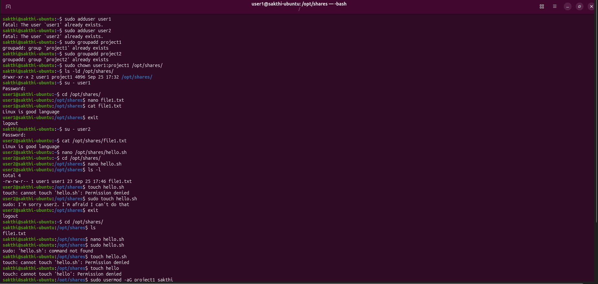
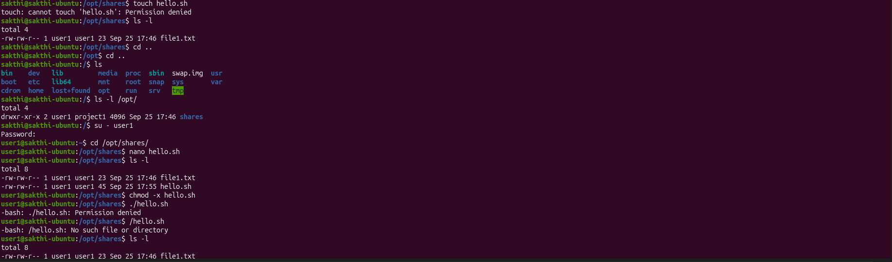
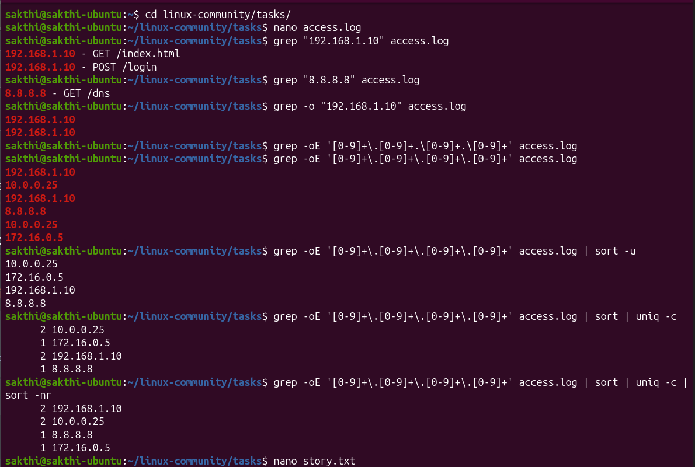
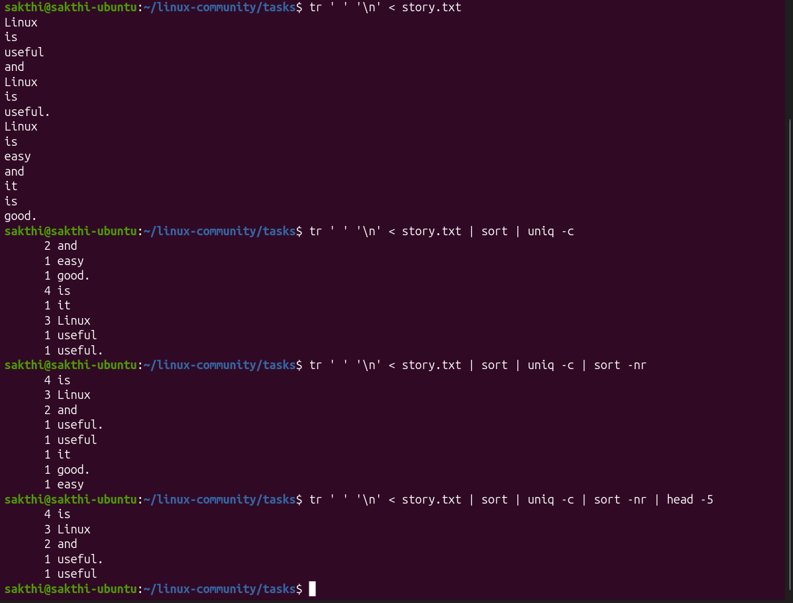
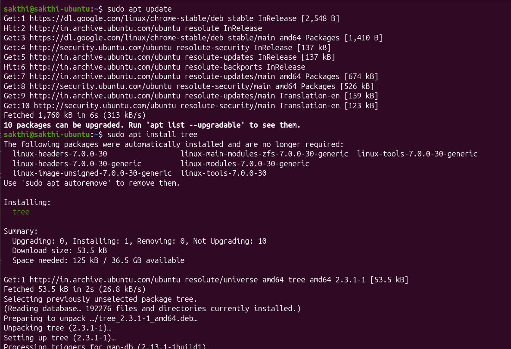
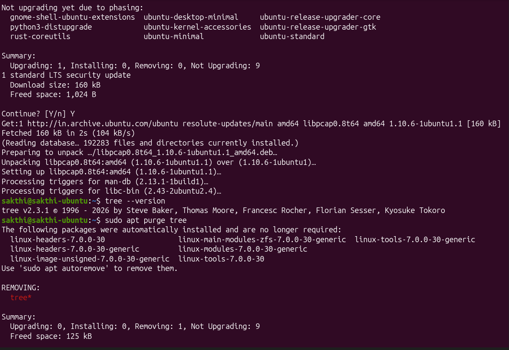
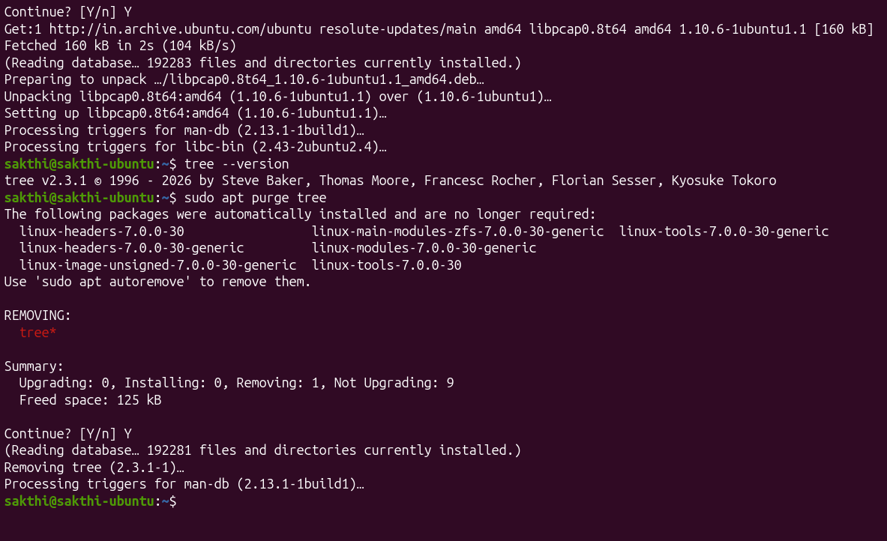

# Linux Community — Linux Tasks 3–5

> Practical work covering Linux user/group management, file permissions, shell-script execution, text processing, log analysis, and package management.

## Overview

| Task | Topic | Main Commands |
|---|---|---|
| **Task 3** | User Management, Group Management, File Permissions & Shell Script Execution | `useradd`, `passwd`, `groupadd`, `mkdir`, `chown`, `su`, `cat`, `nano`, `chmod` |
| **Task 4** | Text Processing & Log Analysis | `grep`, `tr`, `sort`, `uniq`, `head`, pipes |
| **Task 5** | Package Management | `apt update`, `apt install`, `tree --version`, `apt upgrade`, `apt purge` |

---

# Task 3 — Linux User Management, Group Management, File Permissions and Shell Script Execution

## 1. Aim

To understand and perform basic Linux system administration tasks such as creating users and groups, setting passwords, managing directories, changing ownership, accessing files using different users, and executing shell scripts with appropriate permissions.

## 2. Objectives

- Create and manage Linux users.
- Set passwords for users.
- Create Linux groups.
- Create and manage shared directories.
- Change ownership of files and directories.
- Switch between different users.
- Understand Linux file permissions.
- Create and execute shell scripts.
- Use `chmod` to provide execute permission.

## 3. Commands Used

```bash
sudo useradd user1
sudo useradd user2
sudo passwd user1
sudo passwd user2

sudo groupadd project
sudo groupadd project1

sudo mkdir /opt/shares
sudo chown user1:project1 /opt/shares

su - user1
su - user2
cd /opt/shares
cat file1.txt

nano hello.sh
./hello.sh
nano hello1.sh
./hello1.sh
chmod +x hello1.sh
./hello1.sh
```

## 4. Procedure

### Step 1 — Create two Linux users

```bash
sudo useradd user1
sudo useradd user2
```

Set passwords:

```bash
sudo passwd user1
sudo passwd user2
```

### Step 2 — Create project groups

```bash
sudo groupadd project
sudo groupadd project1
```

### Step 3 — Create the shared directory

```bash
sudo mkdir /opt/shares
```

### Step 4 — Change ownership

```bash
sudo chown user1:project1 /opt/shares
```

### Step 5 — Access the shared directory with `user1`

```bash
su - user1
cd /opt/shares
```

Create the file:

```bash
nano file1.txt
```

Display it:

```bash
cat file1.txt
```

Exit:

```bash
exit
```

### Step 6 — Access the file with `user2`

```bash
su - user2
cd /opt/shares
cat file1.txt
```

### Step 7 — Create a shell script

```bash
nano hello.sh
```

Example:

```bash
#!/bin/bash
echo "Hello from Linux"
```

Try to execute:

```bash
./hello.sh
```

### Step 8 — Demonstrate execute permission

```bash
nano hello1.sh
```

Then:

```bash
./hello1.sh
```

If execute permission is missing, a `Permission denied` message can be observed.

Add execute permission:

```bash
chmod +x hello1.sh
```

Execute again:

```bash
./hello1.sh
```

## 5. Result

The Linux user and group management, directory ownership, file access, permissions, and shell script execution tasks were successfully performed.

The practical demonstrated how Linux manages users, groups, ownership, and file permissions and how execute permission is required to run a shell script directly.

## 6. Evidence





---

# Task 4 — Linux Text Processing and Log Analysis

## 1. Aim

To perform basic Linux text-processing operations using `grep`, `tr`, `sort`, `uniq`, `head`, and pipes to extract IP addresses and find the most frequently occurring words.

## 2. Commands Used

```bash
grep "192.168.1.10" access.log
grep "8.8.8.8" access.log
grep -o "192.168.1.10" access.log
grep -oE '[0-9]+\.[0-9]+\.[0-9]+\.[0-9]+' access.log

grep -oE '[0-9]+\.[0-9]+\.[0-9]+\.[0-9]+' access.log | sort -u
grep -oE '[0-9]+\.[0-9]+\.[0-9]+\.[0-9]+' access.log | sort | uniq -c
grep -oE '[0-9]+\.[0-9]+\.[0-9]+\.[0-9]+' access.log | sort | uniq -c | sort -nr

tr ' ' '\n' < story.txt
tr ' ' '\n' < story.txt | sort | uniq -c
tr ' ' '\n' < story.txt | sort | uniq -c | sort -nr
tr ' ' '\n' < story.txt | sort | uniq -c | sort -nr | head -5
```

## 3. Procedure

1. Create and edit `access.log` using `nano`.
2. Use `grep` to search for specific IP addresses.
3. Use `grep -oE` with a regular expression to extract all IP addresses.
4. Use `sort -u` to display unique IP addresses.
5. Use `sort | uniq -c` to count IP occurrences.
6. Use `sort -nr` to arrange IP addresses by frequency.
7. Create `story.txt` containing sample text.
8. Use `tr ' ' '\n'` to convert words into separate lines.
9. Use `sort | uniq -c` to count each word.
10. Use `sort -nr | head -5` to display the top five words.

## 4. Observations

### IP Address Analysis

The task records these unique IP addresses:

- `10.0.0.25`
- `172.16.0.5`
- `192.168.1.10`
- `8.8.8.8`

Frequency shown in the task:

| Count | IP Address |
|---:|---|
| 2 | `192.168.1.10` |
| 2 | `10.0.0.25` |
| 1 | `8.8.8.8` |
| 1 | `172.16.0.5` |

### Word Frequency Analysis

The task records:

| Count | Word |
|---:|---|
| 4 | `is` |
| 3 | `linux` |
| 2 | `useful` |
| 2 | `and` |
| 1 | `it` |

## 5. Result

The Linux text-processing and log-analysis tasks were successfully completed. IP addresses were extracted and counted from `access.log`, while word frequencies were calculated from `story.txt` using Linux pipes and text-processing commands.

## 6. Conclusion

This practical demonstrated how `grep`, `tr`, `sort`, `uniq`, and `head` can be combined using pipes to efficiently process log files and text data.

## 7. Evidence

### IP Address Analysis



### Word Frequency Analysis



---

# Task 5 — Package Management Report

## 1. Aim

To learn basic Linux package management using the `apt` command by updating package information, installing, upgrading, checking, and removing a package.

## 2. Procedure

### Update package information

```bash
sudo apt update
```

### Install `tree`

```bash
sudo apt install tree
```

### Check the installed version

```bash
tree --version
```

### Upgrade the package

```bash
sudo apt upgrade tree
```

### Remove the package

```bash
sudo apt purge tree
```

## 3. Result

The package repository was successfully updated, the `tree` package was installed and its version was verified. The package was then checked for upgrades and successfully removed using `apt purge`.

## 4. Conclusion

The basic Linux package-management operations — update, install, upgrade, and remove — were successfully performed using `apt`.

## 5. Evidence

### Package Management Terminal Evidence







---

# Linux Commands Quick Reference

| Command | Purpose |
|---|---|
| `useradd` | Create a Linux user |
| `passwd` | Set or change a user's password |
| `groupadd` | Create a Linux group |
| `mkdir` | Create a directory |
| `chown` | Change file/directory ownership |
| `su` | Switch to another user |
| `cat` | Display file contents |
| `nano` | Edit a text file |
| `chmod +x` | Add execute permission |
| `grep` | Search text |
| `tr` | Transform characters |
| `sort` | Sort lines |
| `uniq -c` | Count repeated lines |
| `head -5` | Display the first five lines |
| `apt update` | Update package information |
| `apt install` | Install a package |
| `apt upgrade` | Upgrade packages |
| `apt purge` | Remove a package |

---

# Key Linux Concepts Demonstrated

## Users and Groups

Linux supports multiple users and groups so access to files and directories can be managed.

## Ownership

Files and directories have ownership information. `chown` changes the owner and group.

## File Permissions

Linux permissions control read, write, and execute access.

Example:

```bash
chmod +x hello1.sh
```

## Pipes

The `|` operator passes one command's output to another command.

Example:

```bash
sort | uniq -c | sort -nr | head -5
```

This combines several simple commands into a useful text-processing pipeline.

---

# Practical Learning Outcome

After completing these tasks, the following areas were practiced:

- Linux user creation
- Password management
- Group creation
- Directory management
- Ownership management
- Switching users
- File access
- File permissions
- Shell-script execution
- Text searching
- IP-address extraction
- Sorting and frequency counting
- Linux pipelines
- Package installation and removal with `apt`

---

# Linux Community

This practical work is documented as part of the **Linux Community** learning activities.

The goal is to learn Linux through hands-on command execution, observing terminal output, understanding permissions, debugging errors, and documenting the results.

---

## Source and Evidence

The text and terminal screenshots in this README are based on the submitted `LINUX_TASK3-5.pdf`.

